# 🚀 EA Soft Lab - CI/CD Deployment Guide

## 📋 Overview

This guide covers the complete CI/CD pipeline setup for the EA Soft Lab website, including automated testing, building, security checks, and deployment to production.

## 🔧 Prerequisites

### Required Accounts & Tokens

1. **GitHub Repository**
   - Repository: `easoftlab/ea-soft-lab-website`
   - Branch: `main` (production), `develop` (staging)

2. **Vercel Account**
   - Project: `ea-soft-lab-website`
   - Required tokens: `VERCEL_TOKEN`, `VERCEL_ORG_ID`, `VERCEL_PROJECT_ID`

3. **Sanity CMS**
   - Project ID: `oxjbgkqf`
   - Required token: `SANITY_TOKEN`

4. **Security Tools** (Optional)
   - Snyk account for security scanning
   - Required token: `SNYK_TOKEN`

## 🔐 Setting Up GitHub Secrets

Navigate to your GitHub repository → Settings → Secrets and variables → Actions, then add:

### Required Secrets

```bash
# Vercel Deployment
VERCEL_TOKEN=your_vercel_token
VERCEL_ORG_ID=your_vercel_org_id
VERCEL_PROJECT_ID=your_vercel_project_id

# Sanity CMS
SANITY_TOKEN=your_sanity_token

# Security (Optional)
SNYK_TOKEN=your_snyk_token
```

### How to Get Tokens

#### Vercel Tokens
1. Go to [Vercel Dashboard](https://vercel.com/dashboard)
2. Navigate to Settings → Tokens
3. Create a new token with full access
4. Get Org ID and Project ID from project settings

#### Sanity Token
1. Go to [Sanity Dashboard](https://sanity.io/manage)
2. Select your project
3. Go to API → Tokens
4. Create a new token with write permissions

## 🔄 CI/CD Pipeline Workflow

### 📊 Pipeline Stages

```mermaid
graph TD
    A[Push to GitHub] --> B[🧪 Test Stage]
    B --> C[🏗️ Build Stage]
    C --> D[🔒 Security Audit]
    C --> E[⚡ Performance Testing]
    D --> F[🚀 Deploy Staging]
    E --> F
    F --> G[🚀 Deploy Production]
    G --> H[🎨 Deploy Sanity]
    G --> I[🔍 SEO Monitoring]
```



### 🧪 Test Stage
- **Local SEO Tests**: `node tests/run-local-seo-test.js`
- **AI Workflow Demo**: `node tests/ai-workflow-demo.js`
- **SEO Regression Tests**: `npm run seo-test`
- **Code Linting**: `npm run lint`
- **Format Checking**: `npm run format:check`

### 🏗️ Build Stage
- **Astro Application**: `npm run build`
- **Sanity Studio**: `cd ea-soft-lab-cms && npm run build`
- **Artifact Upload**: Build files stored for deployment

### 🔒 Security Stage
- **NPM Audit**: `npm run security-audit`
- **Snyk Security Scan**: High severity threshold
- **Dependency Vulnerability Check**

### ⚡ Performance Stage
- **Lighthouse CI**: Performance, accessibility, SEO, best practices
- **URLs Tested**:
  - `http://localhost:4321` (Homepage)
  - `http://localhost:4321/about` (About)
  - `http://localhost:4321/services` (Services)
  - `http://localhost:4321/contact` (Contact)

### 🚀 Deployment Stages

#### Staging Deployment (`develop` branch)
- **Trigger**: Push to `develop` branch
- **Environment**: Staging
- **URL**: `https://ea-soft-lab-staging.vercel.app`

#### Production Deployment (`main` branch)
- **Trigger**: Push to `main` branch
- **Environment**: Production
- **URL**: `https://ea-soft-lab.vercel.app`

#### Sanity Studio Deployment
- **Trigger**: After successful production deployment
- **URL**: `https://ea-soft-lab.sanity.studio`

### 🔍 SEO Monitoring
- **SEO Regression Tests**: Automated SEO checks
- **File Updates**: `scripts/update-seo-files.js`
- **Report Generation**: SEO monitoring report
- **Artifact Upload**: SEO report stored as artifact

## 🛠️ Manual Deployment

### Local Development
```bash
# Install dependencies
npm ci

# Start development server
npm run dev

# Build for production
npm run build

# Preview production build
npm run preview
```

### Sanity Studio
```bash
# Navigate to CMS directory
cd ea-soft-lab-cms

# Install dependencies
npm ci

# Start development server
npm run dev

# Deploy to Sanity
npx sanity deploy --token YOUR_SANITY_TOKEN
```

## 📊 Monitoring & Analytics

### Performance Monitoring
- **Lighthouse CI**: Automated performance testing
- **Core Web Vitals**: Real-time monitoring
- **Build Analytics**: Vercel analytics dashboard

### SEO Monitoring
- **Automated SEO Tests**: Regression testing
- **Sitemap Generation**: Dynamic XML sitemaps
- **Robots.txt**: Dynamic generation
- **Structured Data**: JSON-LD implementation

### Security Monitoring
- **Dependency Audits**: Automated vulnerability scanning
- **Snyk Security**: Third-party security scanning
- **Content Security Policy**: Headers implementation

## 🔧 Troubleshooting

### Common Issues

#### Build Failures
```bash
# Clear cache and reinstall
rm -rf node_modules package-lock.json
npm ci
npm run build
```

#### Test Failures
```bash
# Run individual tests
node tests/run-local-seo-test.js
node tests/ai-workflow-demo.js
npm run seo-test
```

#### Deployment Issues
```bash
# Check Vercel logs
vercel logs

# Redeploy manually
vercel --prod
```

#### Sanity Issues
```bash
# Check Sanity connection
npx sanity@latest info

# Redeploy Sanity
npx sanity@latest deploy --token YOUR_TOKEN
```

### Environment Variables

#### Required Environment Variables
```bash
# Sanity Configuration
SANITY_PROJECT_ID=oxjbgkqf
SANITY_DATASET=production
SANITY_API_VERSION=2024-01-01

# Vercel Configuration
VERCEL_TOKEN=your_token
VERCEL_ORG_ID=your_org_id
VERCEL_PROJECT_ID=your_project_id
```

## 📈 Performance Optimization

### Build Optimization
- **Dependency Caching**: npm cache optimization
- **Parallel Builds**: Concurrent job execution
- **Artifact Management**: Efficient file storage

### Deployment Optimization
- **Edge Functions**: Serverless API optimization
- **CDN Caching**: Static asset optimization
- **Image Optimization**: Automatic WebP conversion

### SEO Optimization
- **Preloading**: Critical resource preloading
- **DNS Prefetch**: External domain optimization
- **Lazy Loading**: Image and component optimization

## 🔔 Notifications

### Deployment Notifications
- **Success**: Automated success notifications
- **Failure**: Error reporting and rollback
- **Performance**: Lighthouse score reporting

### Monitoring Alerts
- **Security**: Vulnerability alerts
- **Performance**: Performance degradation alerts
- **SEO**: SEO regression alerts

## 📚 Additional Resources

### Documentation
- [Astro Documentation](https://docs.astro.build/)
- [Vercel Documentation](https://vercel.com/docs)
- [Sanity Documentation](https://www.sanity.io/docs)
- [GitHub Actions Documentation](https://docs.github.com/en/actions)

### Support
- **GitHub Issues**: Repository issue tracking
- **Vercel Support**: Deployment support
- **Sanity Support**: CMS support

---

## 🎯 Quick Start Checklist

- [ ] GitHub repository configured
- [ ] GitHub secrets added
- [ ] Vercel project connected
- [ ] Sanity project configured
- [ ] CI/CD pipeline tested
- [ ] Monitoring setup complete
- [ ] Performance baseline established
- [ ] SEO monitoring active

**🚀 Your CI/CD pipeline is ready for production deployment!**
